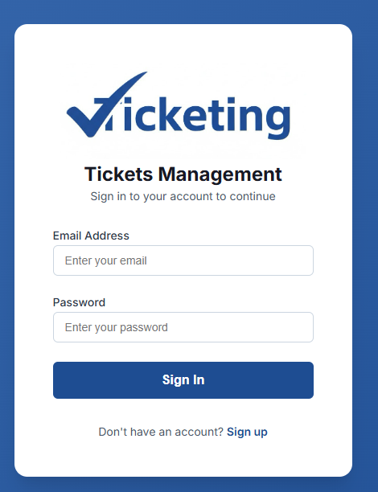
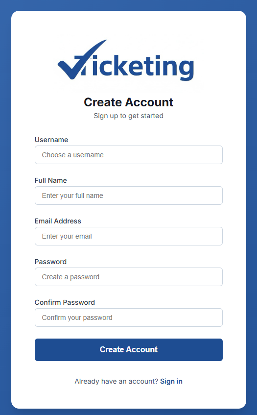
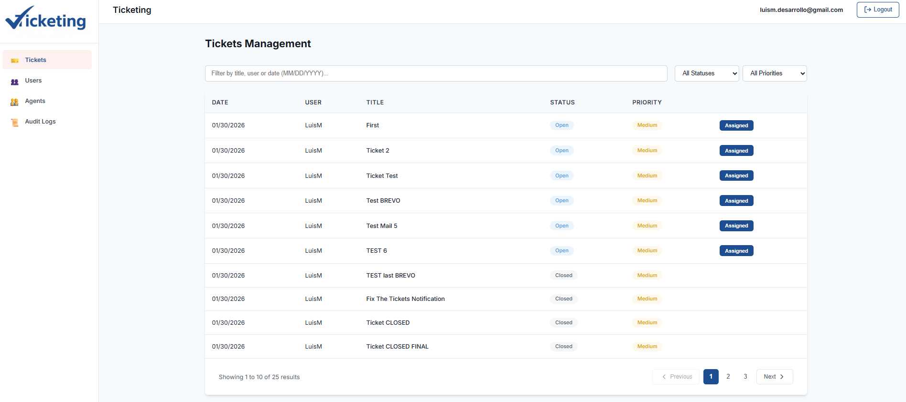
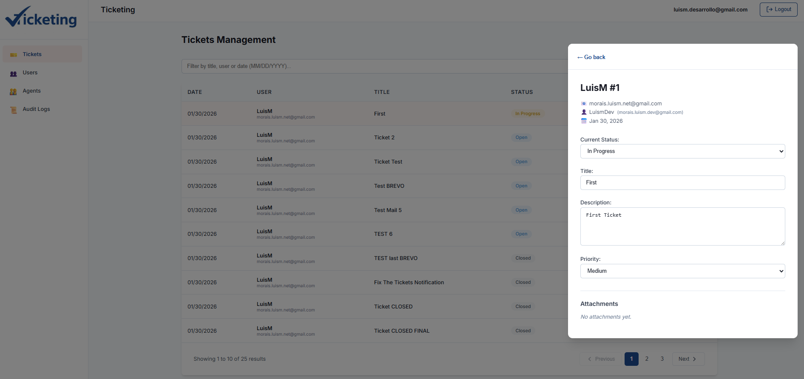
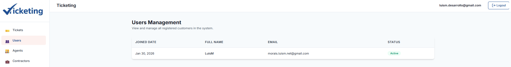
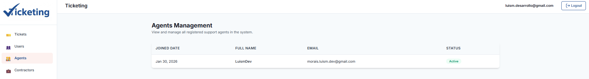
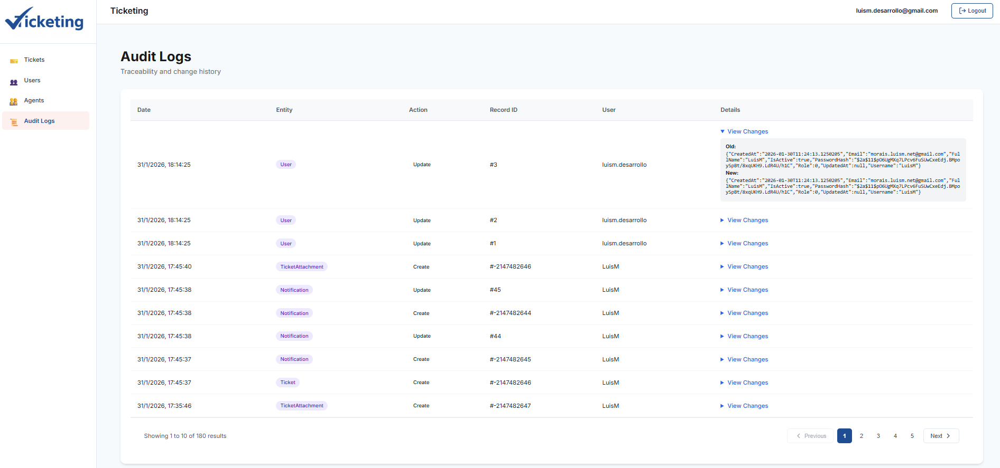
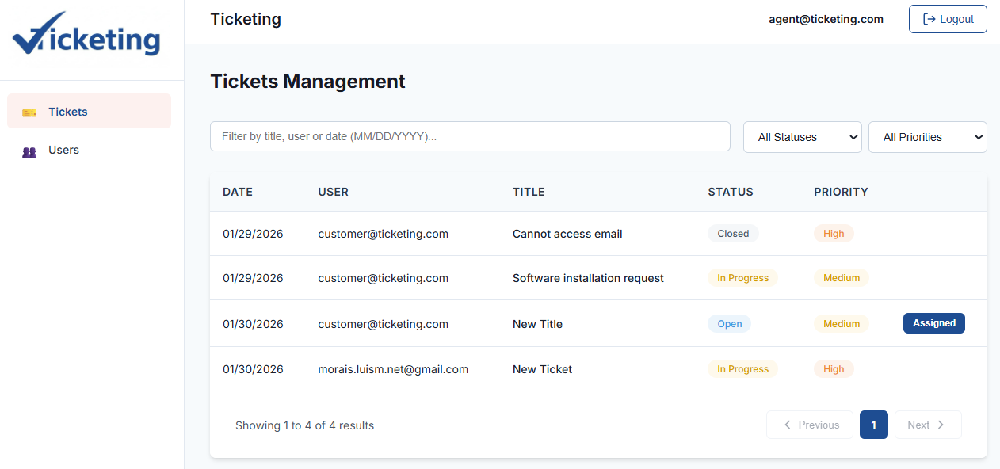
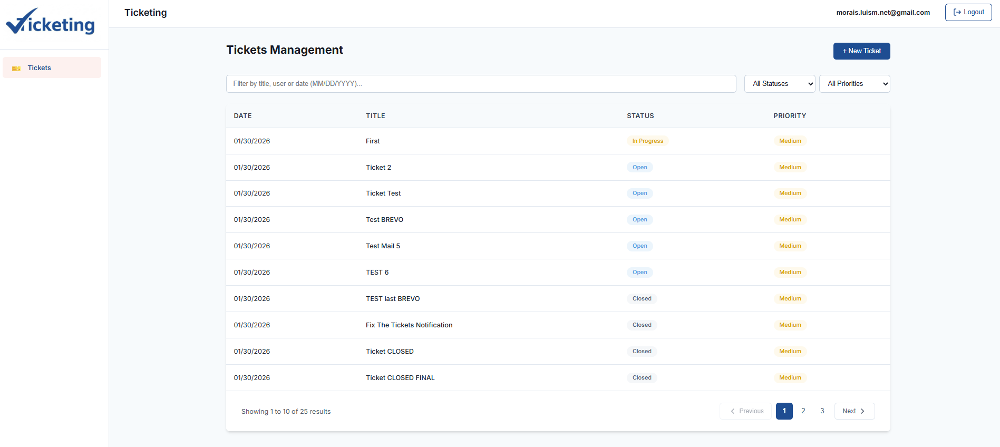
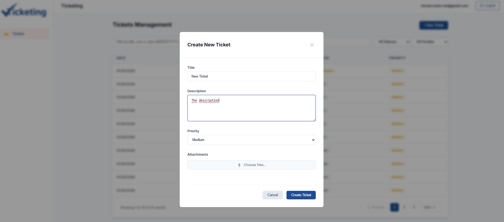

# TicketingAngular

Angular 20 frontend for the Ticketing system.

## Features

- **Authentication**: JWT-based login and registration
- **Tickets Management**: Full CRUD operations with filtering and comments
- **Modern UI**: Clean, professional design with responsive layout
- **Real-time Updates**: Live ticket status and comment updates
- **Progressive Web App (PWA)**: Installable app with offline support and native-like experience

## Prerequisites

- Node.js 18+ and npm
- Angular CLI 20

## Installation

```bash
npm install
```

## Development Server

```bash
npm start
```

Navigate to `http://localhost:4200/`. The application will automatically reload if you change any of the source files.

## Build

```bash
npm run build
```

The build artifacts will be stored in the `dist/` directory.

## Default Credentials

Use these credentials to login (from the backend seeding):

- **Admin**: `admin@ticketing.com` / `Admin123!`
- **Agent**: `agent@ticketing.com` / `Agent123!`
- **Customer**: `customer@ticketing.com` / `Customer123!`

## Project Structure

```
src/
├── app/
│   ├── core/              # Core services, models, guards, interceptors
│   ├── features/          # Feature modules (auth, tickets, etc.)
│   ├── shared/            # Shared components and layouts
│   └── app.config.ts      # Application configuration
├── environments/          # Environment configurations
└── styles.scss           # Global styles
```

## Technologies

- Angular 20 (Standalone Components)
- TypeScript 5.8
- RxJS 7.8
- CSS

## API Configuration

Update the API URL in `src/environments/environment.ts`:

```typescript
export const environment = {
  production: false,
  apiUrl: 'https://localhost:7001/api'
};
```

## 📱 Progressive Web App (PWA)

This application is configured as a PWA. For detailed information about PWA features, installation, and testing, see [PWA_SETUP.md](PWA_SETUP.md).

**Quick start:**
```bash
# Build for production (PWA only works in production mode)
npm run build

# Serve the production build
npx http-server dist/ticketing-angular/browser -p 8080
```

## 📸 Screenshots

| | | |
| :---: | :---: | :---: |
| <kbd></kbd> | <kbd></kbd> | <kbd></kbd> |
| <kbd></kbd> | <kbd></kbd> | <kbd></kbd> |
| <kbd></kbd> | <kbd></kbd> | <kbd></kbd> |
| <kbd></kbd> 

[DeepWiki moraisLuismNet/TicketingAngular](https://deepwiki.com/moraisLuismNet/TicketingAngular)

deployed in:
https://ticketing-angular.vercel.app/auth/login